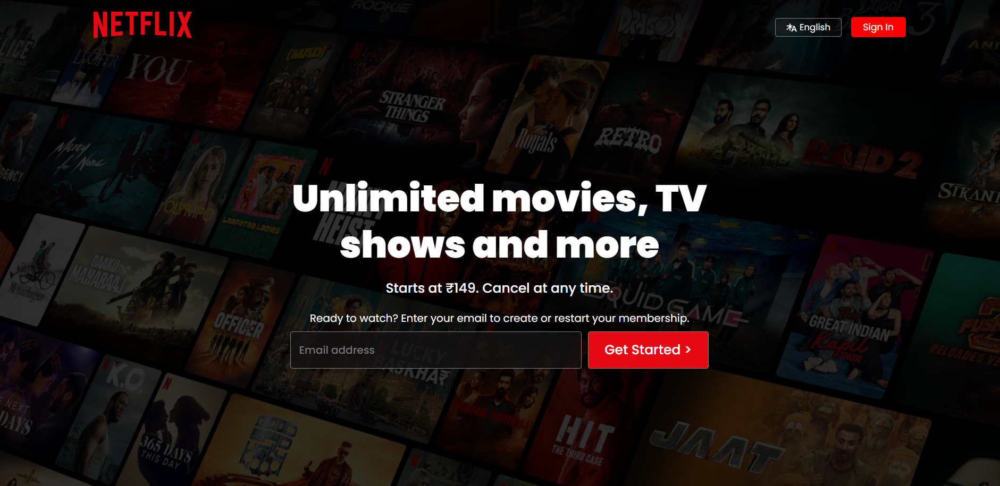

# 🎬 Netflix Clone - HTML & CSS

This is a **Netflix homepage clone** built using only **pure HTML and CSS**.  
The project was created as part of my frontend learning journey to strengthen my understanding of layout design, responsiveness, and pixel-perfect UI development — **without using any frameworks or JavaScript**.

---

## 📸 Preview

 <!-- Replace with actual image path -->

> 📱 Fully responsive design — Desktop, Tablet, and Mobile views.

---

## 🚀 Features

- ✅ Pixel-perfect Netflix homepage layout
- ✅ Responsive design with Flexbox and Media Queries
- ✅ Custom hover effects and buttons
- ✅ Clean and semantic HTML structure
- ✅ No external frameworks, libraries, or JavaScript

---

## 🛠️ Technologies Used

- HTML5
- CSS3 (Flexbox, Grid, Media Queries)

---

## 🧠 What I Learned

- Mastering Flexbox and media queries
- Building responsive UIs from scratch
- Understanding layout structure and spacing
- Practicing real-world design implementation

---
## 💡 Future Improvements

- Add hover-based interactive animations
- Implement JS for functional sliders and login forms
- Add multi-page navigation and footer details

---
## 📜 License

This project is built for educational purposes only. All trademarks and logos belong to Netflix, Inc.

---

